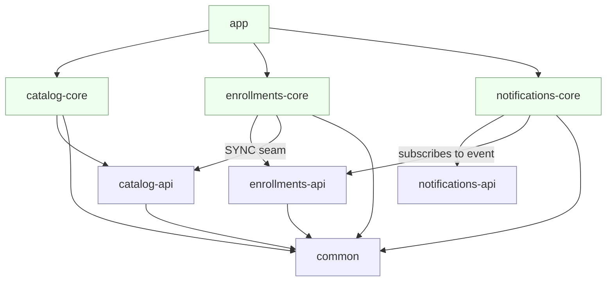

# Training Platform

A tiny slice of a training platform — instructors publish **courses**, visitors submit **enrollments**,
and an **enrollments → notifications** confirmation is sent. The business logic is deliberately small;
the point of this codebase is **how the modules are structured so it stays maintainable and extensible
as domains and teams grow**.

- Java 21 · Spring Boot 3.2.5 · Maven (multi-module) · H2 (in-memory) · Flyway · ArchUnit

---

## Build & run

The Maven Wrapper is included, so no local Maven is required (a JDK 21 is).

```bash
# Build everything and run all tests (unit + integration + architecture)
./mvnw clean verify          # Windows: mvnw.cmd clean verify

# Run the app (single Spring Boot application, one port)
./mvnw -pl app spring-boot:run
# ...or run the packaged jar:
java -jar app/target/app-1.0.0.jar
```

The app listens on **http://localhost:8080**. If that port is busy, pick another:

```bash
java -jar app/target/app-1.0.0.jar --server.port=8390
```

### Try it

```bash
# create a course (capacity 1), then publish it
CID=$(curl -s -XPOST localhost:8080/api/v1/courses -H 'Content-Type: application/json' \
      -d '{"title":"Event-Driven Java","city":"Berlin","capacity":1}' | sed -E 's/.*"id":"([^"]+)".*/\1/')
curl -s -XPOST localhost:8080/api/v1/courses/$CID/publish

# enroll (201) — watch the log: catalog "published" reaction + an EMAIL notification fire
curl -s -XPOST localhost:8080/api/v1/enrollments -H 'Content-Type: application/json' \
     -d "{\"name\":\"Ada\",\"email\":\"ada@example.com\",\"courseId\":\"$CID\"}"

# second enrollment is rejected — course is at capacity (409)
curl -s -XPOST localhost:8080/api/v1/enrollments -H 'Content-Type: application/json' \
     -d "{\"name\":\"Alan\",\"email\":\"alan@example.com\",\"courseId\":\"$CID\"}"

curl -s "localhost:8080/api/v1/enrollments?courseId=$CID"    # list for a course
```

### Endpoints

| Method | Path | Domain | Notes |
|--------|------|--------|-------|
| POST | `/api/v1/courses` | catalog | create (title, city, capacity) → 201 |
| POST | `/api/v1/courses/{id}/publish` | catalog | publish; emits `CoursePublishedEvent` |
| GET  | `/api/v1/courses/{id}` | catalog | fetch one → 200 / 404 |
| POST | `/api/v1/enrollments` | enrollments | enroll (name, email, courseId) → 201 / 404 / 409 |
| GET  | `/api/v1/enrollments?courseId=…` | enrollments | list for a course |

Status codes: `404` course not found · `409` course not published / at capacity · `400` invalid body.

---

## Modules

Each business domain is a **pair** of modules — a thin `-api` (contracts) and a `-core`
(implementation). One `app` module is the composition root. A tiny JDK-only `common` module holds
the cross-domain event abstraction.



**Dependency rules (enforced by the build, re-checked by a test):**

- `<domain>-api` → depends on **nothing but the JDK** (+ the small `common` module). No Spring, no JPA.
- `<domain>-core` → may depend on **another domain's `-api`, never on another `-core`**.
- **JPA entities never cross a module boundary** — every boundary crossing is a DTO (`CourseView`,
  `NotificationMessage`) or a domain-event record.
- Only the `app` module depends on `-core` modules; it wires them together on one port.

Because these rules live in the POMs, a violating dependency simply won't compile. The
[`DomainBoundaryArchitectureTest`](app/src/test/java/com/trainingplatform/app/architecture/DomainBoundaryArchitectureTest.java)
(ArchUnit) is the belt-and-suspenders: it fails the build if a `-core` reaches into another `-core`,
if an `-api` references Spring/JPA, or if an `@Entity` escapes a `-core`. *(Verified: injecting a
catalog-core → enrollments-core reference makes that test — and the build — fail.)*

### The two cross-domain seams

**1. Synchronous read — `CoursesApi` (an interface).**
`enrollments-core` checks whether a course exists / is published / its capacity **only** through
[`CoursesApi`](catalog-api/src/main/java/com/trainingplatform/catalog/api/CoursesApi.java), which
returns a `CourseView` DTO. It never touches catalog's service, entity, or table. The single
implementation today ([`CoursesApiAdapter`](catalog-core/src/main/java/com/trainingplatform/catalog/core/course/CoursesApiAdapter.java))
is in-process; swapping it for an HTTP client is a new class behind the same interface — **no change
to the calling code**.

**2. Asynchronous notification — a publisher/handler abstraction.**
Producers publish through [`DomainEventPublisher`](common/src/main/java/com/trainingplatform/common/event/DomainEventPublisher.java);
consumers implement [`DomainEventHandler`](common/src/main/java/com/trainingplatform/common/event/DomainEventHandler.java).
Neither ever references Spring's `@EventListener` or a broker client. The **only** place the transport
is named is the app's [`DomainEventDispatcher`](app/src/main/java/com/trainingplatform/app/event/DomainEventDispatcher.java)
+ [`SpringDomainEventPublisher`](app/src/main/java/com/trainingplatform/app/event/SpringDomainEventPublisher.java).
Moving to a message broker rewrites those two classes and leaves every producer and consumer
untouched. Domain-event records live in the **publisher's** `-api` module
(`CoursePublishedEvent` in catalog-api, `EnrollmentCreatedEvent` in enrollments-api).

Flow: publish course → `CoursePublishedEvent` → enrollments "warms" (logs) · enroll → `EnrollmentCreatedEvent`
→ notifications sends a confirmation.

---

## The extensibility probe — adding `notifications`

**What I had to touch to add the notifications domain:**

| Change | Kind |
|--------|------|
| `notifications-api/**`, `notifications-core/**` | new files (the new module pair) |
| root `pom.xml` — 2 `<module>` lines + 2 version entries | build file |
| `app/pom.xml` — one dependency on `notifications-core` | build file |
| `app/.../application.yml` — one Flyway location line | config |
| `app/.../NotificationOnEnrollmentIntegrationTest.java` | new test file |

**Zero source files in `enrollments-core` (or any other domain) were modified.** This is visible in
the git history: the notifications commit's diff contains no `enrollments-core` path.

**Why the list is that short:**

- `enrollments-core` already published `EnrollmentCreatedEvent` through the `DomainEventPublisher`
  seam, **blind to who — if anyone — listens**. Notifications just subscribes.
- The app's `DomainEventDispatcher` already routes *any* `DomainEvent` to *any* `DomainEventHandler`
  by type, and component-scanning + `@EntityScan` over `com.trainingplatform` auto-discover the new
  handler, service, channel, and entity. No wiring code was needed.
- A second delivery channel (e.g. SMS) is added the same way — one new class implementing
  [`NotificationChannel`](notifications-api/src/main/java/com/trainingplatform/notifications/api/NotificationChannel.java);
  `NotificationService` injects `List<NotificationChannel>` and changes nothing.

The only unavoidable touches are the composition root telling **Maven** a new module exists and
telling **Flyway** where the new migrations live — neither can be inferred, and both are build/config,
not domain code.

---

## Testing

Proportionate, not exhaustive (run with `./mvnw test`):

- **Architecture** — `DomainBoundaryArchitectureTest` (ArchUnit): fails the build on a core→core
  dependency, a framework leak into `-api`, or an entity outside `-core`.
- **Integration** — `EnrollmentFlowIntegrationTest` and `NotificationOnEnrollmentIntegrationTest`
  drive the real HTTP layer + a real (H2) DB with Flyway applied, covering the happy path
  **publish → enroll → notification produced** plus the not-published / at-capacity / not-found / bad-input rules.
- **Unit** — `EnrollmentServiceCapacityTest` pins the capacity + published rules in isolation (mocked
  collaborators). This is where a unit test earns its keep.

---

## Decisions (and the alternative rejected)

1. **Maven multi-module, not one module with package discipline.** Rejected a single module because
   the api/core boundary has to be enforced at **compile time**: a consumer of `catalog-api` must not
   get catalog's entities or Spring on its classpath, and "don't import that package" is a convention
   a test can only nag about. Modules make the boundary physical.

2. **Cross-domain read = plain interface returning a DTO + `Optional` (`CoursesApi`).** Rejected a
   shared DB / direct repository access, and rejected throwing across the boundary. Returning a
   `CourseView` keeps the entity in, keeps the caller decoupled, and lets the impl become an HTTP
   client later with no caller change; `Optional` keeps "not found" out of exception control flow.

3. **Custom publisher/handler seam + one app-level dispatcher, not `@EventListener` in consumers.**
   Rejected annotating consumers directly with Spring's `@EventListener`/`@TransactionalEventListener`,
   because that stamps a transport choice onto every consumer. Isolating it in the app's two transport
   classes means the broker migration is a two-file change. Cost: one small dispatcher — worth it.

4. **No DB foreign key across domains; cross-domain ids are plain `UUID`s.** Rejected a FK from
   `enrollments`/`notifications` to `courses`, because a FK couples the schemas and forecloses on
   separate databases or the future HTTP split. The relationship is an application invariant, enforced
   through `CoursesApi`.

5. **H2 in-memory + Flyway with a migration folder per domain, `ddl-auto=validate`.** Rejected a
   single shared migration folder (schema ownership would blur and notifications couldn't add its
   table without editing a shared location), rejected Testcontainers/Postgres (keeps "one command, no
   Docker"), and rejected `ddl-auto=create`/`none` in favour of `validate` so entity/schema drift
   fails fast. SQL is written portably so the same migrations run on Postgres.

---

## Deliberately skipped (timebox)

- **Capacity race condition.** The check-then-insert isn't guarded against concurrent requests (two
  could both pass at capacity − 1). Production fix: a conditional/atomic insert, a `SELECT … FOR
  UPDATE`, an optimistic-version column, or a DB constraint. Called out, not implemented.
- **Publish-after-commit.** Events fire synchronously inside the transaction. A real broker needs
  publish *after commit* (e.g. the outbox pattern) so nothing is published on rollback. Kept
  synchronous here so the happy-path test is simple and deterministic.
- **Duplicate-enrollment guard** (same email twice), auth, pagination, richer error payloads,
  observability, OpenAPI, and a Testcontainers/Postgres profile — all out of scope per the brief's
  non-goals.

---

## Follow-up notes (re: section 8)

- **If the two domains shared one module** — the api/core compile-time boundary disappears first:
  enrollments could reach straight into catalog's entities/repositories, the DTO discipline erodes,
  and the "swap to HTTP" seam is gone. The ArchUnit slice test is the only thing left, and it's
  weaker than a missing dependency.
- **If `CoursesApi` became a 50 ms, sometimes-failing HTTP call** — only `CoursesApiAdapter` changes
  (or a new HTTP adapter replaces it); callers are untouched. What you'd add lives there too: timeout,
  retry, circuit-breaker, and a caching/degradation policy. The `CourseView` contract stays.
- **Enrollments scoped per instructor organisation** — that's an enrollments-domain concern: an
  `orgId` on the enrollment + every query filtered by it (ideally enforced as a cross-cutting filter),
  with `orgId` arriving on the request. Catalog is unaffected.
- **In-process publisher → broker** — `SpringDomainEventPublisher` and `DomainEventDispatcher` change
  (two files), plus serialization for the event records. Producers and consumers do not change,
  because they only touch the `common` interfaces.
